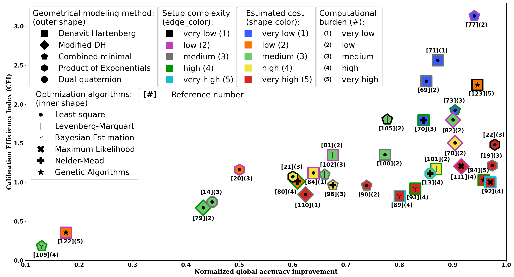

# Supplementary materials for the paper called: Comprehensive Review of Calibration Techniques for Serial Link Manipulators: Insights into Mathematical and Methodological Evolutions
___
## Table of context
- Explanation of the source codes 
- Usage
- Table of comparison
- Generated diagram
- Reference list of the paper
- Acknowledgement


___

### Explanation of the source codes 
#### - extractor.py

This script automatically matches bibliography entries from a .bib file with their citation numbers in a PDF document and stores the extracted citation IDs in a YAML configuration file. It searches the reference section of the PDF, identifies each reference by its author list, extracts the corresponding citation number (e.g., [42]), and updates the YAML database.

#### - diagram.py

This code creates a scatter plot visualization of calibration approaches based on their normalized accuracy improvement and Calibration Efficiency Index (CEI), which is calculated by the values presented in the data.yaml file.


#### - table.py

This code automatically generates a LaTeX table from a YAML database containing calibration-method information.
It loads the calibration data from data.yaml, then processes each entry by extracting the citation ID, modeling method, optimization method, estimated cost, setup complexity, computational cost, and accuracy values.

___

### Usage 

- Install the necessary python packages:
```bash
pip3 install pypdf pybtex pyyaml matplotlib
```

- Rename your .pdf file into Paper.pdf
- Run the extractor python script
```bash
python3 extractor.py
```
During the runtime, all of the citation number must be manually typed into the terminal (after that type "enter"), for the corresponding papers.

- Run the diagram or the table python script corresponding to your needs: 
```bash
python3 diagram.py
```

```bash
python3 table.py
```


___
### The overall Table of comparison
The following table presents the CEI values and the corresponding characteristics of the reviewed calibration approaches, sorted in descending order according to the CEI. The table columns are defined as follows:

- **Citation:** Reference number of the calibration approach.
- **Modeling:** Kinematic modeling technique:
  - **DH** – Denavit–Hartenberg
  - **MDH** – Modified Denavit–Hartenberg
  - **MIX** – Combined minimal representations
  - **POE** – Product of Exponentials
  - **DQ** – Dual Quaternions
- **Optimization:** Optimization method used:
  - **LS** – Least-Squares
  - **LM** – Levenberg–Marquardt
  - **NM** – Nelder–Mead
  - **BE** – Bayesian Estimation
  - **MLE** – Maximum Likelihood Estimation
  - **GA** – Genetic Algorithm
- **Estimated Cost:** Estimated implementation cost, rated from **1 (very low)** to **5 (very high)**.
- **Setup Complexity:** Complexity of the calibration setup, considering factors such as the number of measurement points, required equipment, and experimental configuration, rated from **1 (very low)** to **5 (very high)**.
- **Computational Cost:** Computational burden of the calibration method, rated from **1 (very low)** to **5 (very high)**.
- **Normalized Accuracy:** Normalized accuracy improvement achieved by the calibration approach.
- **CEI:** Calibration Efficiency Index of the corresponding approach.


| Citation | Modeling | Optimization | Estimated cost | Setup complexity | Comput. cost | Norm. acc. | CEI |
|----------|----------|--------------|----------------|------------------|--------------|------------|------|
| [77]  | MIX | LS  | very low (1)  | low (2)         | low (2)        | 0.94000 | 3.13333 |
| [71]  | DH  | LS  | very low (1)  | medium (3)      | very low (1)   | 0.87143 | 2.56303 |
| [69]  | DH  | LS  | very low (1)  | medium (3)      | low (2)        | 0.85000 | 2.29730 |
| [123] | DH  | GA  | low (2)       | very low (1)    | very high (5)  | 0.94545 | 2.25108 |
| [73]  | MIX | LS  | very low (1)  | high (4)        | medium (3)     | 0.90385 | 1.92308 |
| [105] | MIX | LM  | medium (3)    | very low (1)    | low (2)        | 0.77664 | 1.80614 |
| [82]  | MDH | LS  | medium (3)    | low (2)         | low (2)        | 0.90000 | 1.80000 |
| [70]  | DH  | NM  | very low (1)  | high (4)        | medium (3)     | 0.84474 | 1.79731 |
| [78]  | MDH | LS  | high (4)      | low (2)         | low (2)        | 0.90386 | 1.50643 |
| [22]  | POE | LS  | very high (5) | very low (1)    | medium (3)     | 0.97846 | 1.48252 |
| [100] | DH  | LS  | medium (3)    | medium (3)      | low (2)        | 0.77273 | 1.35566 |
| [81]  | DH  | LM  | medium (3)    | low (2)         | low (2)        | 0.67500 | 1.35000 |
| [19]  | POE | LS  | very high (5) | medium (3)      | medium (3)     | 0.97346 | 1.21683 |
| [111] | MDH | MLE | very high (5) | low (2)         | high (4)       | 0.91571 | 1.20488 |
| [101] | DH  | LM  | high (4)      | high (4)        | low (2)        | 0.86842 | 1.17354 |
| [20]  | POE | LS  | low (2)       | low (2)         | medium (3)     | 0.50000 | 1.16279 |
| [84]  | DH  | LS  | high (4)      | low (2)         | very low (1)   | 0.63889 | 1.12086 |
| [13]  | DQ  | NM  | medium (3)    | very high (5)   | high (4)       | 0.85714 | 1.11317 |
| [102] | MIX | LM  | medium (3)    | medium (3)      | medium (3)     | 0.65998 | 1.09996 |
| [21]  | POE | LS  | high (4)      | very low (1)    | medium (3)     | 0.60000 | 1.07143 |
| [94]  | DH  | GA  | very high (5) | high (4)        | very high (5)  | 0.95719 | 1.02923 |
| [80]  | MDH | NM  | low (2)       | high (4)        | high (4)       | 0.60857 | 1.01428 |
| [92]  | DH  | MLE | very high (5) | very high (5)   | high (4)       | 0.97016 | 1.00016 |
| [96]  | MIX | NM  | high (4)      | medium (3)      | medium (3)     | 0.67500 | 0.96429 |
| [90]  | MIX | LS  | very high (5) | medium (3)      | low (2)        | 0.73846 | 0.95904 |
| [93]  | DH  | BE  | very high (5) | high (4)        | high (4)       | 0.82957 | 0.92175 |
| [110] | MDH | LS  | very high (5) | medium (3)      | very low (1)   | 0.62397 | 0.84320 |
| [89]  | DH  | BE  | very high (5) | very high (5)   | high (4)       | 0.80022 | 0.82497 |
| [14]  | DQ  | LS  | medium (3)    | medium (3)      | medium (3)     | 0.44894 | 0.74823 |
| [79]  | MDH | LS  | medium (3)    | high (4)        | low (2)        | 0.43247 | 0.67574 |
| [122] | DH  | GA  | low (2)       | low (2)         | very high (5)  | 0.17518 | 0.35752 |
| [109] | MIX | BE  | medium (3)    | high (4)        | high (4)       | 0.12972 | 0.18531 |

___

### Generated diagram


___

### Reference list of the paper
--8<-- "bibliography.md"
___

### Acknowledgement
